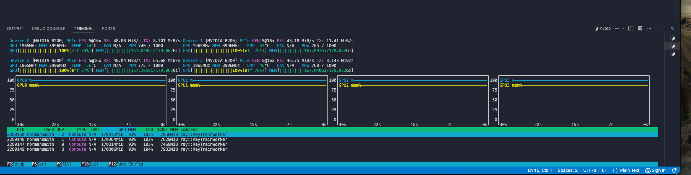

# OneStepFlowsLearning
IMF, SoFlow,etc to learn One Step Generation for VLA 

### Training and Inference

*GPU Util With JVP*

Note: Without high enough batch size, the JVP bottlenecks the GPU util and becomes compute/dispatch bound. Decent efficiency for using forward JVP. 